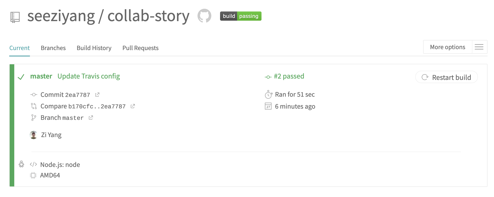

# CollabStory

An open platform for everyone to write a story together, sentence by sentence.

## Running the API locally

### Prerequisites

- `node` v12.14.1 or above
- `npm` v6.14.5 or above
- `nodemon` v2.0.4 or above
- `MongoDB` v4.4 or above

To run the API install, please ensure you have the above installed.

### Running the API on localhost:8080

At the root of this folder, run the following:

- `npm install` to install the dependencies
- `mongod` to start MongoDB (Please check the MongoDB documentation if you face any error at this step)
- `npm run dev` to start the server

The backend server should be running on http://localhost:8080/, and the APIs are available at http://localhost:8080/api/sentences.

You should see an empty array, i.e. [], when you access http://localhost:8080/api/sentences.

You can test out the API according to the documentation below.

## API Documentation

### GET `/api/sentences`

Returns all the sentences as an array.

Each sentence has the following keys:

- `_id` String: The sentence's ID.
- `text` String: The sentence's text.
- `createdOn` String: Timestamp of sentence's creation
- `font` String?: The sentence's font.
- `size` Number?: The sentence's font size.
- `style` String?: The sentence's font style.

### POST `/api/sentences`

Create a new sentence.

Body parameters:

- `text` String (required): The sentence's text.
- `font` String (optional): The sentence's font.
- `size` Number (optional): The sentence's font size.
- `style` String (optional): The sentence's font style.

### GET `/api/sentences/:id`

Returns the sentence that has the given ID.

The sentence has the following keys:

- `_id` String: The sentence's ID.
- `text` String: The sentence's text.
- `createdOn` String: Timestamp of sentence's creation
- `font` String?: The sentence's font.
- `size` Number?: The sentence's font size.
- `style` String?: The sentence's font style.

### PUT `/api/sentences/:id`

Update the sentence that has the given ID.

Body parameters:

- `text` String (optional): The sentence's text.
- `font` String (optional): The sentence's font.
- `size` Number (optional): The sentence's font size.
- `style` String (optional): The sentence's font style.

### PATCH `/api/sentences/:id`

Update the sentence that has the given ID.

Body parameters:

- `text` String (optional): The sentence's text.
- `font` String (optional): The sentence's font.
- `size` Number (optional): The sentence's font size.
- `style` String (optional): The sentence's font style.

### DELETE `/api/sentences/:id`

Delete the sentence that has the given ID.

## Accessing the deployed API

## Running the tests locally

To run the tests locally, ensured that you have installed the prerequisites, have ran `npm install` and `mongod` is running.
Then, run `npm run test` to run the tests locally.

## Running the tests via Travis

The tests are automatically triggered and run on Travis with every push to GitHub. You can view the Travis link [here](https://travis-ci.org/github/seeziyang/collab-story).

Inside `.travis.yml`, I specify `mongodb` as one of the services. This will start the mongodb process before running my test script, which is initiated by `npm run test`. I defined the `npm run test` scripts in my `package.json` file. Travis runs `npm install` by default as part of its install step for Node.js. I added a `sleep 15` to `before_script` as suggested in [here](https://docs.travis-ci.com/user/database-setup/#mongodb) to ensure that the database will accept the connections once the test start.

Screenshots showing an example of a Travis build:

## Running the Frontend locally
